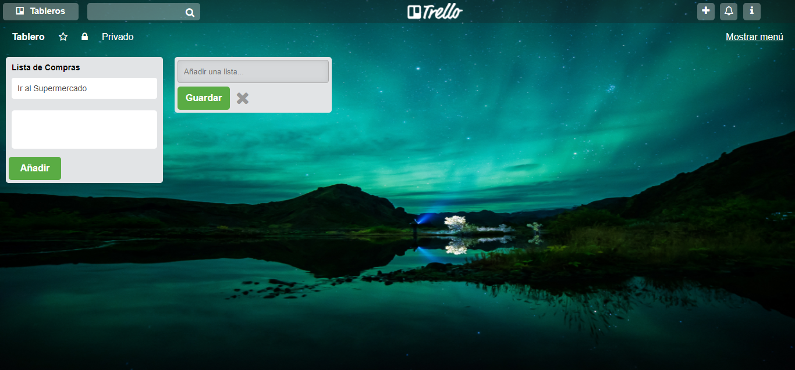

# Replica de Trello

## Objetivo
---
En este reto, se solicitó replicar el tablero de Trello, según un flujo de versiones para ir habilitando poco a poco la funcionalidad de la página.

## Versiones Solicitadas
---
### Versión 0.0.1

* Se mostrará el texto "Añadir una lista ...".
* Al hacer click se debe ocultar el texto y mostrar un formulario.
* El formulario está conformado por un input y un botón para que pueda añadir tareas a tu lista.

### Versión 0.0.2

* Al dar click en el botón de "Guardar", se mostrará un nuevo cuadro donde estará el nombre de la lista agregada.
* Mostrar un texto de "Añadir una tarea" dentro de la lista.
### Versión 0.0.3

* Al dar click en "Añadir una tarea", deberá mostrar un formulario con un textarea y un botón que diga "Añadir".
### Versión 0.0.4

* Poner focus al textarea al dar click en "Agregar nueva tarea".
* Al dar click en el botón de "Añadir", deberá aparecer el texto de la tarea debajo del título de la lista.
### Versión 0.0.5

* Mostrar el formulario nuevamente debajo de la última tarea añadida.
### Versión 0.0.6 (Extra)

* Poder agregar múltiples listas con tarjetas. Para esto, el formulario de "Añadir una lista" debe aparecer a la derecha de la lista anteriormente creada.

## Especificaciones de la Página
--- 
* La página principal es denominada `index.html` en el cual se encuentra la  estructura del proyecto y se enlaza la hoja  de estilos (CSS).

* En la carpeta `css` se encuentra el archivo `main.css` donde se han agragado los  estilos necesarios para el proyecto.

* En la carpeta `assets` se encuentra la carpeta `images` donde estan las imágenes necesarias para el proyecto.

* Esta web utiliza 1 tipografía :   `Arial`.

* La paleta de colores se basa en estos tres : `#e2e4e6`, `#5aac44`,
  `#999999`.

* Los íconos se obtuvieron de  [Font Awesome](http://fontawesome.io/).

* En el desarrollo del proyecto se han utilizado diferentes tipos de efectos sobre algunos títulos e imágenes, todo esto especificado en la hoja de estilos main.css.

Realizado por Carla Centeno Ramos.